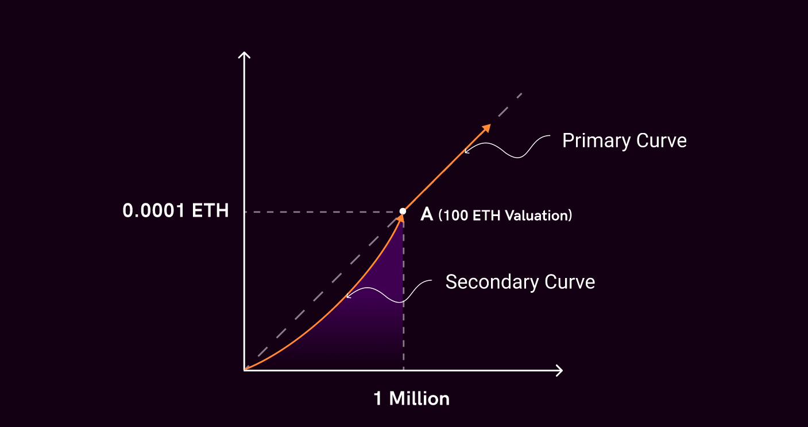

# Nibbl - C4

# Why Fractionalization

# Protocol

A fractionalization protocol that creates ERC20 tokens representing ownership of ERC721 or ERC1155. Uses a **Bonding curve** to facilitate buying and selling of tokens. The protocol also implements a valuation-based buyout mechanism so that the asset isn’t locked in a contract/vault forever. A user can initiate a buyout and they need to pay an upfront cost for that. The cost is decided based on the current valuation of tokens. If the valuation goes above a certain level within a predefined duration the buyout is rejected. Therefore, the community can buy more tokens in order to reject a buyout. If the buyout isn’t rejected it is automatically considered successful and the user who initiated the buyout can withdraw the asset.

# Architecture

To read about Bonding Curves visit [here](https://yos.io/2018/11/10/bonding-curves/).

## Double Bonding Curve

The vault works on 2 different **BondingCurves** a primary curve and a secondary curve. The primary curve has a fixed reserve ratio and the secondary curve has a dynamic reserve ratio. The secondary curve is defined by various parameters like the initial reserve balance deposited by the curator (original NFT curator) and the initial token supply minted to the curator.

It gives flexibility to the curator for the liquidity he wanted to add to kickstart the bonding curve.

Let’s assume that someone wanted to fractionalize an ERC721 which is valued around 100 ETH (point A in the graph), he would want to allow people to buy only at or above the 100 ETH valuation in this case. In this example, if the reserve ratio of the bonding curve was 50%, in order to take the curve’s valuation from 100 ETH, he would need to put in 50 ETH as the reserve balance. **For most cases, this value is too high, ideally, the NFT curator would want to put in 5-10% of the valuation for liquidity which would give a reserve ratio of 5-10% from origin to point A** - **(1).**

To accommodate this, we allow the NFT curator to deposit any amount of liquidity from the origin point to the initial point (A in this case) and we calculate the reserve ratio of the curve according to the amount of liquidity put by the curator. For example, if he adds 10 ETH worth of liquidity at 100 ETH valuation, the reserve ratio of the lower curve (called the secondary curve in the codebase) becomes 10%.

Also, note that the **curator would want the reserve ratio of the primary curve to be a decent amount (50% in this example) so that his share of ownership doesn’t get diluted too much - (2).**



## **Trading Fees**

Whenever someone mints and burns tokens on the bonding curve, they need to pay some trading fees which is accrued in ETH, there are 3 types of fees in our current system.

1. **Admin Fees** (defined in factory contract) - This fee goes to the Nibbl protocol treasury address and has a maximum cap of 0.2% per transaction.
2. **Curator Fees** (defined in vault contract) - Curator fees accrue to the original NFT curator and functions like royalties in NFTs. The curator can redeem the fees accrued at any time to an address of his liking. Curator fees are directly proportional to the initial secondary reserve ratio - this was done to incentivize liquidity addition by the original owner.
3. **Curve Fees** - Since the reserve ratio of the secondary curve is lower than that of the primary curve, some of the trading fees are used to increase the reserve ratio of the secondary curve until it becomes equal to the primary curve. As referred to in the image below, as trading happens, the reserve ratio of the secondary curve increases from 10% to 20% and eventually to 50% via the curve fees (1% in this example).


## Buyout mechanism, TWAV, Buyout rejection - price increases, Buyout success - token redemption, NFT unlocking


### 1. **Buyout Initialization**

An NFT collector is interested to buy the whole original fractionalized bored ape NFT that is backing the fractional tokens.

In our system, if someone wants to buy the whole NFT, the total bid amount has to equal the current valuation in the bonding curve. This is done so that the current token owners are able to redeem their tokens at the current valuation in case of a successful buyout. Let’s now understand how much money would someone need to put in this scenario.

At any given point, there is always some liquidity in the system, the total liquidity can be written as Liquidity in primary Curve plus liquidity in secondary curve. Since continuous bonding curves are single-sided curves, no one actually owns the ETH put in the bonding curve, so in case of a successful buyout, the ETH deposited there would also be used in redemption, as a result, a buyout bid can be triggered at the current valuation without needing to add amount for liquidity.

Buyout Deposit Amount = `Current Valuation - Liquidity`

*The buyout is initiated at the current valuation and if someone deposits more money than the current valuation, then the difference is refunded in the same transaction*

For example, if *the secondary reserve balance was 10 ETH, the primary reserve balance was 10 ETH, and the bonding curve valuation was 120 ETH. In order to trigger a buyout at the current valuation of 120 ETH, the bidder would need to submit 100 ETH which is calculated as `120 (Valuation) - 20 (Total Liquidity in Primary and Secondary Curve)`.*

### 2. **Buyout Rejection**

We define a `buyoutRejectionValuation` which is calculated as `buyoutBid * (1 + buyoutRejectionPremium)`  The buyout would get rejected if in any n day period (n=3 in our current implementation) starting from the time the buyout bid is placed, the time weighted average valuation (TWAV) becomes greater than or equal to buyoutRejectionValuation. Let’s assume buyoutRejectionPremium as 10%, then buyoutRejectionValuation = 120*(1+0.1) = 132. So whenever TWAV reaches 132 ETH within the n day period, the buyout gets rejected instantly and the curve continues as it is and the original bidder can withdraw his money back. **Note**: We are using TWAV instead of instant valuation from the bonding curve because in case of instant valuation, someone can buy tokens→ increase the valuation above the rejection valuation→ reject the buyout→ instantly dump the tokens all in one block, TWAV helps in preventing this.

The incentives of buyout are such that, from the buyout bid valuation to buyout rejection valuation, someone would buy only if they want to reject the buyout (or believe buyout is going to get rejected) because in the case the buyout becomes succesful, they will be getting money at the buyout bid valuation instead of the valuation they bought at. For example, when buyout bid is 150 ETH, then from 150 to 165 ETH valuation, someone would only be buying if they believe the buyout is going to get rejected, otherwise, their tokens are going to be redeemed at a 150 ETH valuation.

### 3. **Buyout Success - Pausing of the curve, NFT Unlocking and Token Redemption**

The buyout would be successful if, in a certain predefined time (3 days in our current implementation) starting from the time the buyout bid is placed, the time-weighted average valuation (TWAV) doesn’t go above the buyoutRejectionValuation.

**a) Pausing of the curve:** After the buyout succeeds, minting and burning tokens via the bonding curve stops in our system. 

**b) NFT Unlocking:** The bidder can unlock the NFT from the vault in case of buyout success.

**c) Token redemption:** In the case of buyout success, token holders are able to redeem their tokens for ETH at the buyout valuation. The redeemed ETH is in proportion to the token supply someone owns.

# Smart Contracts
## **Smart Contracts in scope of Audit**

Note : Bonding curves

| File | LoC | External Calls | Description |
| --- | --- | --- | --- |
| NibblVaultFactory.sol | 70 |  | Vault Factory that deploys vault and handles governance and access control. |
| NibblVault.sol | 290 |  | Vault which holds NFT and has logic for trading and buyout |
| Twav.sol | 25 |  | Implements time-weighted valuation to be consumed in NibblVault for buyouts |
| ProxyVault.sol | 17 |  | Proxy contract that gets deployed with implementation as NibblVault |
| ProxyBasket.sol | 17 |  | Proxy contract that gets deployed with implementation as Basket |
| AccessControlMechanism.sol | 19 |  | Inherited in NibblVaultFactory for access control on certain actions |
| EIP712Base.sol | 21 |  | To implement permit functionality with EIP712 signing. |

# NibblVaultFactory.sol

- Deploys NibblVault
- Handles Admin functions like pausing and updating implementations.

## Functions

### createVault

This function is used to create a new vault based on various parameters passed in by the curator. It deploys a proxy contract and initialises it with the given variables, then transfers the ERC721 asset to the vault and stores the vault’s address.

```solidity
function createVault(
        address _assetAddress,
        address _curator,
        string memory _name,
        string memory _symbol,
        uint256 _assetTokenID,
        uint256 _initialSupply,
        uint256 _initialTokenPrice,
        uint256 _minBuyoutTime
        ) external payable override whenNotPaused returns(address payable _proxyVault) {
        require(msg.value >= MIN_INITIAL_RESERVE_BALANCE, "NibblVaultFactory: Initial reserve balance too low");
        require(IERC721(_assetAddress).ownerOf(_assetTokenID) == msg.sender, "NibblVaultFactory: Invalid sender");
        _proxyVault = payable(new Proxy{salt: keccak256(abi.encodePacked(_curator, _assetAddress, _assetTokenID, _initialSupply))}(payable(address(this))));
        NibblVault _vault = NibblVault(payable(_proxyVault));
        _vault.initialise{value: msg.value}(_name, _symbol, _assetAddress, _assetTokenID, _curator, _initialSupply,_initialTokenPrice, _minBuyoutTime);
        IERC721(_assetAddress).safeTransferFrom(msg.sender, address(_vault), _assetTokenID);
        nibbledTokens.push(Proxy(_proxyVault));
        emit Fractionalise(_assetAddress, _assetTokenID, _proxyVault);
    }
```

### withdrawAdminFee

Transfers admin fee to feeTo address.

```solidity
function withdrawAdminFee() external override {
        (bool _success, ) = payable(feeTo).call{value: address(this).balance}("");
        require(_success);
}
```

### proposeNewAdminFeeAddress

Proposes a new feeTo address. feeTo address can be updated after a timelock of UPDATE_TIME.

```solidity
function proposeNewAdminFeeAddress(address _newFeeAddress) external override onlyRole(FEE_ROLE) {
        pendingFeeTo = _newFeeAddress;
        feeToUpdateTime = block.timestamp + UPDATE_TIME;
}
```

### updateNewAdminFeeAddress

Updates admin address to the new proposed address.

```solidity
function updateNewAdminFeeAddress() external override {
        require(feeToUpdateTime != 0 && block.timestamp >= feeToUpdateTime, "NibblVaultFactory: UPDATE_TIME has not passed");
        feeTo = pendingFeeTo;
        delete feeToUpdateTime;
}
```

### proposedNewAdminFee

Proposes a new admin fee. admin fee can be updated after a timelock of UPDATE_TIME.

```solidity
function proposeNewAdminFee(uint256 _newFee) external override onlyRole(FEE_ROLE) {
        require(_newFee <= MAX_ADMIN_FEE, "NibblVaultFactory: Fee value greater than MAX_ADMIN_FEE");
        pendingFeeAdmin = _newFee;
        feeAdminUpdateTime = block.timestamp + UPDATE_TIME;
}
```

### updateNewAdminFee

Updates new proposed address.

```solidity
function updateNewAdminFee() external override {
        require(feeAdminUpdateTime != 0 && block.timestamp >= feeAdminUpdateTime, "NibblVaultFactory: UPDATE_TIME has not passed");
        feeAdmin = pendingFeeAdmin;
        delete feeAdminUpdateTime;
}
```

### proposeNewVaultImplementation

Proposes a new vault implementation. vault implementation can be updated after a timelock of UPDATE_TIME.

```solidity
function proposeNewVaultImplementation(address _newVaultImplementation) external override onlyRole(IMPLEMENTER_ROLE) {
        pendingVaultImplementation = _newVaultImplementation;
        vaultUpdateTime = block.timestamp + UPDATE_TIME;
}
```

### updateVaultImplementation

Updates new proposed vault implementation.

```solidity
function updateVaultImplementation() external override {
        require(vaultUpdateTime != 0 && block.timestamp >= vaultUpdateTime, "NibblVaultFactory: UPDATE_TIME has not passed");
        vaultImplementation = pendingVaultImplementation;
        delete vaultUpdateTime;
}
```

### pause

pauses the system.

```solidity
function pause() external onlyRole(PAUSER_ROLE) override {
        _pause();
  }
```

### unpause

unpauses the system.

```solidity
function unPause() external onlyRole(PAUSER_ROLE) override {
        _unpause();
}
```

# NibblVault.sol

- A proxy contract with implementation as nibblVaultImplementation in NibblVaultFactory
- ERC20 Contract
- NFT Holder
- Holds logic for the trade of ERC20 tokens and buyout of ERC721
    
    
    ## Functions
    
    ### initialise
    
    initialises the vault, should be called when deploying the vault. Sets various params and secondaryReserveRatio according to initial liquidity.
    
    ```solidity
    function initialise(
            string memory _tokenName, 
            string memory _tokenSymbol, 
            address _assetAddress,
            uint256 _assetID,
            address _curator,
            uint256 _initialTokenSupply,
            uint256 _initialTokenPrice,
            uint256 _minBuyoutTime
        ) external override initializer payable {
            uint32 _secondaryReserveRatio = uint32((msg.value * SCALE * 1e18) / (_initialTokenSupply * _initialTokenPrice));
            require(_secondaryReserveRatio <= primaryReserveRatio, "NibblVault: Excess initial funds");
            require(_secondaryReserveRatio >= MIN_SECONDARY_RESERVE_RATIO, "NibblVault: secResRatio too low");
            INIT_EIP712("NibblVault", "1");
            __ERC20_init(_tokenName, _tokenSymbol);
            unlocked = 1;
            initialTokenPrice=_initialTokenPrice;
            factory = payable(msg.sender);
            assetAddress = _assetAddress;
            assetID = _assetID;
            curator = _curator;
            initialTokenSupply = _initialTokenSupply;
            uint _primaryReserveBalance = (primaryReserveRatio * _initialTokenSupply * _initialTokenPrice) / (SCALE * 1e18);
            primaryReserveBalance = _primaryReserveBalance;
            fictitiousPrimaryReserveBalance = _primaryReserveBalance;
            secondaryReserveBalance = msg.value;
            secondaryReserveRatio = _secondaryReserveRatio;
            curatorFee = _secondaryReserveRatio * 10000 / primaryReserveRatio; //curator fee is proportional to the secondary reserve ratio/primaryReseveRatio i.e. initial liquidity added by curator
            minBuyoutTime = _minBuyoutTime;
            _mint(_curator, _initialTokenSupply);
        }
    ```
    
    ### buy
    
    buys fractionalized tokens. Evaluates the situation of curve and buys token on the corresponding primary and secondary curve.
    
    ```solidity
    function _buyPrimaryCurve(uint256 _amount, uint256 _totalSupply) private returns (uint256 _purchaseReturn) {
            uint256 _amountIn = _chargeFee(_amount);
            uint256 _primaryReserveBalance = primaryReserveBalance;
            _purchaseReturn = _calculatePurchaseReturn(_totalSupply, _primaryReserveBalance, primaryReserveRatio, _amountIn);
            primaryReserveBalance = _primaryReserveBalance + _amountIn;
        }
    
        function _buySecondaryCurve(uint256 _amount, uint256 _totalSupply) private returns (uint256 _purchaseReturn) {
            uint256 _amountIn = _chargeFeeSecondaryCurve(_amount);
            uint _secondaryReserveBalance = secondaryReserveBalance;
            _purchaseReturn = _calculatePurchaseReturn(_totalSupply, _secondaryReserveBalance, secondaryReserveRatio, _amountIn);
            secondaryReserveBalance = _secondaryReserveBalance + _amountIn;
        }
    
        function buy(uint256 _minAmtOut, address _to) external override payable notBoughtOut lock whenNotPaused returns(uint256 _purchaseReturn) {
            //Make update on the first tx of the block
            if (status == Status.buyout) {
                uint32 _blockTimestamp = uint32(block.timestamp % 2**32);
                if (_blockTimestamp != lastBlockTimeStamp) {
                    _updateTWAV(getCurrentValuation(), _blockTimestamp);   
                    _rejectBuyout();
                }
            }
            uint256 _initialTokenSupply = initialTokenSupply;
            uint256 _totalSupply = totalSupply();
            if (_totalSupply >= _initialTokenSupply) {
                _purchaseReturn = _buyPrimaryCurve(msg.value, _totalSupply);
            } else {
                uint256 _lowerCurveDiff = getMaxSecondaryCurveBalance() - secondaryReserveBalance;
                if (_lowerCurveDiff >= msg.value) {
                    _purchaseReturn = _buySecondaryCurve(msg.value, _totalSupply);
                } else {
                    //Gas Optimization
                    _purchaseReturn = _initialTokenSupply - _totalSupply;
                    secondaryReserveBalance += _lowerCurveDiff;
                    // _purchaseReturn = _buySecondaryCurve(_to, _lowerCurveDiff);
                    _purchaseReturn += _buyPrimaryCurve(msg.value - _lowerCurveDiff, _totalSupply + _purchaseReturn);
                } 
            }
            require(_minAmtOut <= _purchaseReturn, "NibblVault: Return too low");
            _mint(_to, _purchaseReturn);
            emit Buy(msg.sender, _purchaseReturn, msg.value);
        }
    ```
    

### sell

sells fractionalized tokens. Evaluates the situation of curve and sells tokens on corresponding primary and secondary curve.

```solidity
function _sellPrimaryCurve(uint256 _amount, uint256 _totalSupply) private returns(uint256 _saleReturn) {
        uint _primaryReserveBalance = primaryReserveBalance;
        _saleReturn = _calculateSaleReturn(_totalSupply, _primaryReserveBalance, primaryReserveRatio, _amount);
        primaryReserveBalance = _primaryReserveBalance - _saleReturn;
        _saleReturn = _chargeFee(_saleReturn);
    }

    function _sellSecondaryCurve(uint256 _amount, uint256 _totalSupply) private returns(uint256 _saleReturn){
        uint _secondaryReserveBalance = secondaryReserveBalance;
        _saleReturn = _calculateSaleReturn(_totalSupply, _secondaryReserveBalance, secondaryReserveRatio, _amount);
        secondaryReserveBalance = _secondaryReserveBalance - _saleReturn;
        require(_secondaryReserveBalance - _saleReturn >= MIN_SECONDARY_RESERVE_BALANCE, "NibblVault: Excess sell");
        _saleReturn = _chargeFeeSecondaryCurve(_saleReturn);
    }

    function sell(uint256 _amtIn, uint256 _minAmtOut, address payable _to) external override notBoughtOut whenNotPaused returns(uint256 _saleReturn) {
        //Make update on the first tx of the block
        if (status == Status.buyout) {
            uint32 _blockTimestamp = uint32(block.timestamp % 2**32);
            if (_blockTimestamp != lastBlockTimeStamp) {
                _updateTWAV(getCurrentValuation(), _blockTimestamp);   
                _rejectBuyout(); //For the case when TWAV goes up when updated on sell
            }
        }
        uint256 _initialTokenSupply = initialTokenSupply;
        uint256 _totalSupply = totalSupply();
        if(_totalSupply > _initialTokenSupply) {
            if ((_initialTokenSupply + _amtIn) <= _totalSupply) {
                _saleReturn = _sellPrimaryCurve(_amtIn, _totalSupply);
            } else {
                //Gas Optimization
                uint256 _tokensPrimaryCurve = _totalSupply - _initialTokenSupply;
                _saleReturn = primaryReserveBalance - fictitiousPrimaryReserveBalance;
                primaryReserveBalance -= _saleReturn;
                _saleReturn = _chargeFee(_saleReturn);
                // _saleReturn = _sellPrimaryCurve(_tokensPrimaryCurve);
                _saleReturn += _sellSecondaryCurve(_amtIn - _tokensPrimaryCurve, _initialTokenSupply);
            } } else {
                _saleReturn = _sellSecondaryCurve(_amtIn,_totalSupply);
        }
        require(_saleReturn >= _minAmtOut, "NibblVault: Return too low");
        _burn(msg.sender, _amtIn);
        safeTransferETH(_to, _saleReturn); //send _saleReturn to _to
        emit Sell(msg.sender, _amtIn, _saleReturn);
    }
```

### initiateBuyout

initiates buyout. User needs to deposit a certain amount to initiate the buyout. The buyout is initiated at current valuation and TWAV array is initialised. 

```solidity
function initiateBuyout() external override payable whenNotPaused returns(uint256 _buyoutBid) {
        require(block.timestamp >= minBuyoutTime, "NibblVault: minBuyoutTime < now");
        require(status == Status.initialised, "NibblVault: Status!=Initialised");
        _buyoutBid = msg.value + (primaryReserveBalance - fictitiousPrimaryReserveBalance) + secondaryReserveBalance;
        //_buyoutBid: Bid User has made
        uint256 _currentValuation = getCurrentValuation();
        require(_buyoutBid >= _currentValuation, "NibblVault: Bid too low");
        // buyoutValuationDeposit = _currentValuation - ((primaryReserveBalance - fictitiousPrimaryReserveBalance) + secondaryReserveBalance); 
        buyoutValuationDeposit = msg.value - (_buyoutBid - _currentValuation);
        bidder = msg.sender;
        buyoutBid = _currentValuation;
        // buyoutBid: Bid can only be placed at current valuation
        buyoutRejectionValuation = (_currentValuation * (SCALE + REJECTION_PREMIUM)) / SCALE;
        buyoutEndTime = block.timestamp + BUYOUT_DURATION;
        status = Status.buyout;
        _updateTWAV(_currentValuation, uint32(block.timestamp % 2**32));
        if (_buyoutBid > _currentValuation) {
            safeTransferETH(payable(msg.sender), (_buyoutBid - _currentValuation));
        }
        emit BuyoutInitiated(msg.sender, _buyoutBid);
}
```

### _rejectBuyout

Called in buy, sell and updateTWAV function when the vault is in buyout. This function rejects buyout if TWAV≥buyoutRejectionValuation

```solidity
function _rejectBuyout() private notBoughtOut {
        uint256 _twav = _getTwav();
        if (_twav >= buyoutRejectionValuation) {
            uint256 _buyoutValuationDeposit = buyoutValuationDeposit;
            unsettledBids[bidder] += _buyoutValuationDeposit;
            totalUnsettledBids += _buyoutValuationDeposit;
            delete buyoutRejectionValuation;
            delete buyoutEndTime;
            delete bidder;
            delete twavObservations;
            delete twavObservationsIndex;
            delete lastBlockTimeStamp;
            status = Status.initialised;
            emit BuyoutRejected(_twav);
        }
    }
```

### updateTWAV

Updates TWAV array when buyout is active.

```solidity
function updateTWAV() external override {
        require(status == Status.buyout, "NibblVault: Status!=Buyout");
        uint32 _blockTimestamp = uint32(block.timestamp % 2**32);
        if (_blockTimestamp != lastBlockTimeStamp) {
            _updateTWAV(getCurrentValuation(), _blockTimestamp);   
            _rejectBuyout(); //For the case when TWAV goes up when updated externally
        }
}
```

### withdrawUnsettledBids

Allows the buyout bidder to withdraw his funds in case buyout has been rejected.

```solidity
function withdrawUnsettledBids(address payable _to) external override {
        uint _amount = unsettledBids[msg.sender];
        delete unsettledBids[msg.sender];
        totalUnsettledBids -= _amount;
        safeTransferETH(_to, _amount);
}
```

### redeem

Lets users redeem their tokens for ETH after a successful buyout.

```solidity
function redeem(address payable _to) external override boughtOut returns(uint256 _amtOut){
        uint256 _balance = balanceOf(msg.sender);
        _amtOut = ((address(this).balance - feeAccruedCurator - totalUnsettledBids) * _balance) / totalSupply();
        _burn(msg.sender, _balance);
        safeTransferETH(_to, _amtOut);
}
```

### redeemCuratorFee

Lets curator withdraw accrued fee.

```solidity
function redeemCuratorFee(address payable _to) external override returns(uint256 _feeAccruedCurator) {
        require(msg.sender == curator,"NibblVault: Only Curator");
        _feeAccruedCurator = feeAccruedCurator;
        feeAccruedCurator = 0;
        safeTransferETH(_to, _feeAccruedCurator);
}
```

### withdrawERC721

Lets the bidder withdraw an ERC721 when the buyout has completed successfully.

```solidity
function withdrawERC721(address _assetAddress, uint256 _assetID, address _to) external override boughtOut {
        require(msg.sender == bidder,"NibblVault: Only winner");
        IERC721(_assetAddress).safeTransferFrom(address(this), _to, _assetID);
}
```

### withdrawMultipleERC721

Lets the bidder withdraw multiple ERC721s when the buyout has completed successfully.

```solidity
function withdrawMultipleERC721(address[] memory _assetAddresses, uint256[] memory _assetIDs, address _to) external override boughtOut {
        require(msg.sender == bidder,"NibblVault: Only winner");
        for (uint256 i = 0; i < _assetAddresses.length; i++) {
            IERC721(_assetAddresses[i]).safeTransferFrom(address(this), _to, _assetIDs[i]);
        }
    }
```

### withdrawERC20

Lets the bidder withdraw an ERC20 when the buyout has completed successfully.

```solidity
function withdrawERC20(address _asset, address _to) external override boughtOut {
        require(msg.sender == bidder, "NibblVault: Only winner");
        IERC20(_asset).transfer(_to, IERC20(_asset).balanceOf(address(this)));
    }
```

### withdrawMultipleERC20

Lets the bidder withdraw multiple ERC20s when the buyout has completed successfully.

```solidity
function withdrawMultipleERC20(address[] memory _assets, address _to) external override boughtOut {
        require(msg.sender == bidder, "NibblVault: Only winner");
        for (uint256 i = 0; i < _assets.length; i++) {
            IERC20(_assets[i]).transfer(_to, IERC20(_assets[i]).balanceOf(address(this)));
        }
    }
```

### withdrawERC1155

Lets the bidder withdraw a ERC1155 when the buyout has completed successfully.

```solidity
function withdrawERC1155(address _asset, uint256 _assetID, address _to) external override boughtOut {
        require(msg.sender == bidder, "NibblVault: Only winner");
        uint256 balance = IERC1155(_asset).balanceOf(address(this),  _assetID);
        IERC1155(_asset).safeTransferFrom(address(this), _to, _assetID, balance, "0");
    }
```

### withdrawMultipleERC1155

Lets the bidder withdraw multiple ERC1155s when the buyout has completed successfully.

```solidity
function withdrawMultipleERC1155(address[] memory _assets, uint256[] memory _assetIDs, address _to) external override boughtOut {
        require(msg.sender == bidder, "NibblVault: Only winner");
        for (uint256 i = 0; i < _assets.length; i++) {
            uint256 balance = IERC1155(_assets[i]).balanceOf(address(this),  _assetIDs[i]);
            IERC1155(_assets[i]).safeTransferFrom(address(this), _to, _assetIDs[i], balance, "0");
        }
    }
```

### permit

erc20 permit - allowance via metaTx

```solidity
function permit(
address owner,
address spender,
uint256 value,
uint256 deadline,
uint8 v,
bytes32 r,
bytes32 s
) external override {
require(block.timestamp <= deadline, "ERC20Permit: expired deadline");
bytes32 structHash = keccak256(abi.encode(PERMIT_TYPEHASH, owner, spender, value, nonces[owner]++, deadline));
address signer = ecrecover(toTypedMessageHash(structHash), v, r, s);
require(signer == owner, "ERC20Permit: invalid signature");
_approve(owner, spender, value);
}
```

# Twav.sol

- Time-weighted average valuation
- Uses an array of length 4 which stores cumulative valuation and timestamp.
- TWAV is calculated between the most and least recent observations recorded in the array.
- TWAV array is updated only when the system is in buyout state. In case of buyout rejection, the array is reset.

## Function

### _updateTWAV

updates the twav array. Is called when the vault is in buyout on trades or when updateTWAV is called.

```solidity
function _updateTWAV(uint256 _valuation, uint32 _blockTimestamp) internal {
        uint32 _timeElapsed; 
        unchecked {
            _timeElapsed = _blockTimestamp - lastBlockTimeStamp;
        }

        uint256 _prevCumulativeValuation = twavObservations[((twavObservationsIndex + TWAV_BLOCK_NUMBERS) - 1) % TWAV_BLOCK_NUMBERS].cumulativeValuation;
        twavObservations[twavObservationsIndex] = TwavObservation(_blockTimestamp, _prevCumulativeValuation + (_valuation * _timeElapsed)); //add the previous observation to make it cumulative
        twavObservationsIndex = (twavObservationsIndex + 1) % TWAV_BLOCK_NUMBERS;
        lastBlockTimeStamp = _blockTimestamp;
}
```

### _getTwav

returns current time weighted average valuation. If buyout is inactive, then returns 0.

```solidity
function _getTwav() internal view returns(uint256 _twav){
        if (twavObservations[TWAV_BLOCK_NUMBERS - 1].timestamp != 0) {
            uint8 _index = ((twavObservationsIndex + TWAV_BLOCK_NUMBERS) - 1) % TWAV_BLOCK_NUMBERS;
            TwavObservation memory _twavObservationCurrent = twavObservations[(_index)];
            TwavObservation memory _twavObservationPrev = twavObservations[(_index + 1) % TWAV_BLOCK_NUMBERS];
            _twav = (_twavObservationCurrent.cumulativeValuation - _twavObservationPrev.cumulativeValuation) / (_twavObservationCurrent.timestamp - _twavObservationPrev.timestamp);
      }
}
```

# AccessControlMechanism.sol

- Inherits openzepplin/AccessControl.sol
- Manages access granting, proposing, and claiming access
- Used in various functions in NibblVaultFactory

# EIP712Base.sol

- Utility functions for EIP712 signing to be used in permit function in a vault.